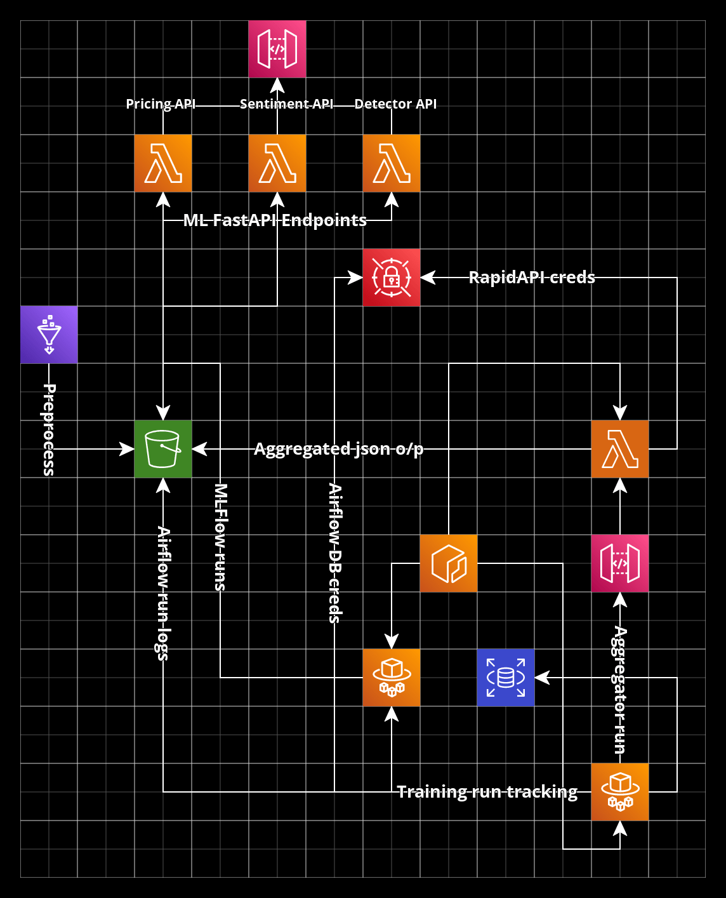

# Terraform repo for provisioning end to end data science projects

### Following are the components for the services that are being worked on to be provisioned:

- Storage
    - S3 bucket for storing intermediate objects 
    - RDS (Postgres) for Airflow metadata

- Lambda with ECR and API gateway
    - For aggregator code as it will be containerized and hosted as a lambda endpoint
    - For hosting ML endpoints under fastapi 

- ECS 
    - For hosting Airflow and MLFlow 
    
- AWS Glue
    - For creating ETL job with preprocessing logic to clean the gathered data

